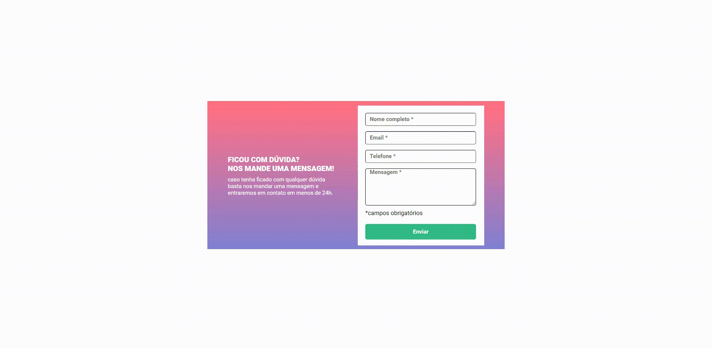

# Formulário com validação 



## ✨ Sobre o projeto

Essa foi a Quest de HTML + CSS + JS intermediário do curso DevQuest, onde o objetivo é criar um formulário de validação usando JavaScript puro. foi disponibilizado um layout no Figma junto com as orientações de como devia ser a validação.

## 🚀 Aprendizado

Consegui colocar em prática meus conhecimentos em JavaScript para resolver o desafio da melhor forma possível, fiquei bastante feliz com o resultado e vou continuar praticando para alcançar um melhor desempenho.

## 📚 Guia de Utilização:

1° Clone o repositório

```
git clone https://github.com/luizgustavogaldino/desafio-formulario.git
```

2° Caso não queira clonar o repositório, acesse o Deployment [clicando aqui](https://luizgustavogaldino.github.io/desafio-formulario/).

## 🛠️ Tecnologias Utilizadas

- HTML
- CSS
- JavaScript

### Obrigado por visitar meu repositório!❤️